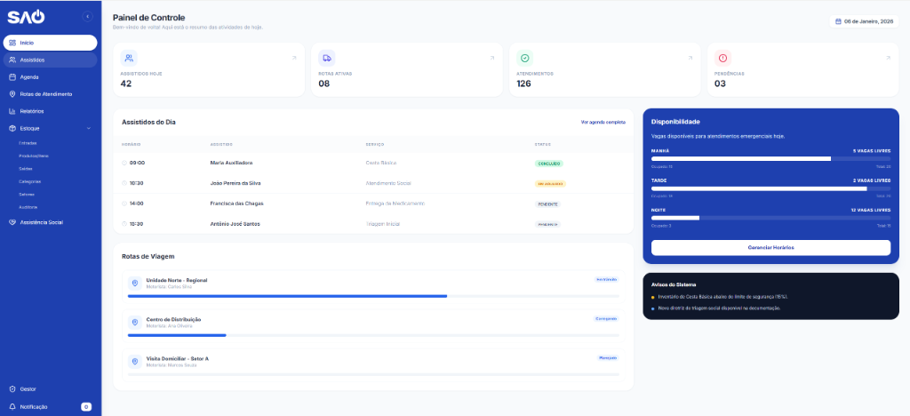

# Sistema SAO - Gestão e Assistência

## Sobre o Projeto

Este é o **Sistema SAO**, uma plataforma dedicada à gestão e assistência. 

Este repositório contém a implementação completa, incluindo o **Backend** do projeto que dará suporte a todas as funcionalidades de gestão de estoque, rotas, assistidos e administração.

## Tecnologias

- **Frontend**: React, TypeScript, Tailwind CSS, Vite
- **Backend**: (Em desenvolvimento)
